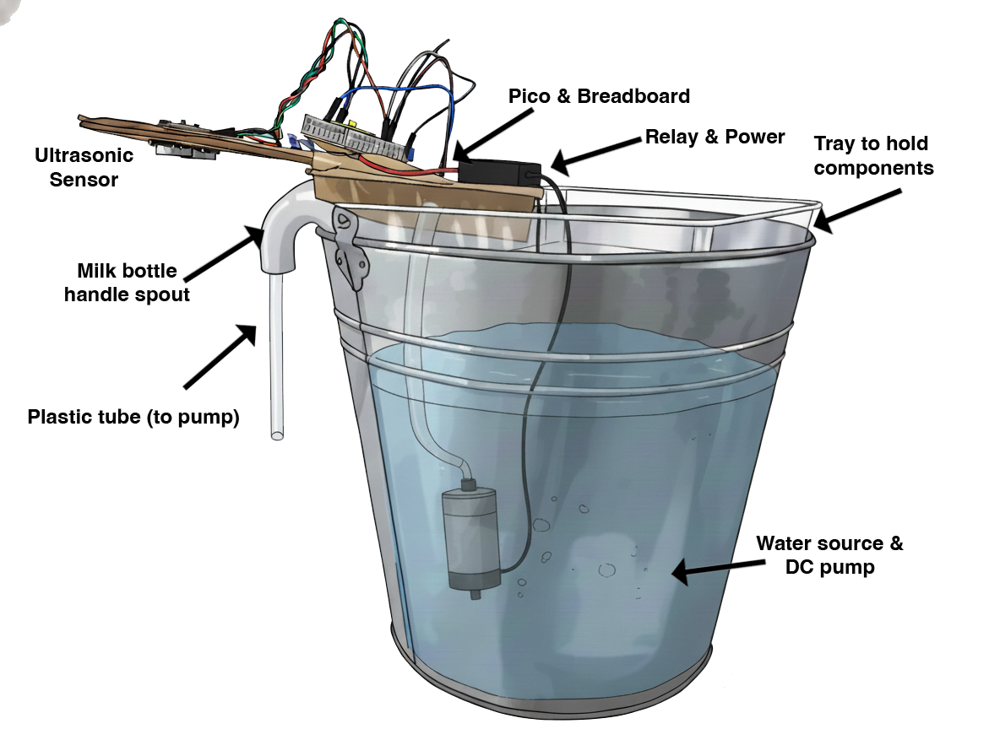

## Prepare and mount the sensor

Create a small, splash-resistant mount so the ultrasonic faces downward towards the basin and ignores stray reflections.

--- task ---
Cut a small piece of plastic or print a bracket that can hold the ultrasonic sensor level and add a short “hood” so water splashes do not hit the sensor.
--- /task ---

--- task ---
Mark and drill two holes for screws or zip ties to secure the sensor. Ensure the bracket keeps the sensor at least 6–8 cm above the expected water level.
--- /task ---

--- task ---
Fix the bracket to a safe stand or mock basin. Ensure no conductive parts can short the Pico or relay.
--- /task ---

This example uses recycled plastic containers, cardboard and a bucket as a simple prototype:

