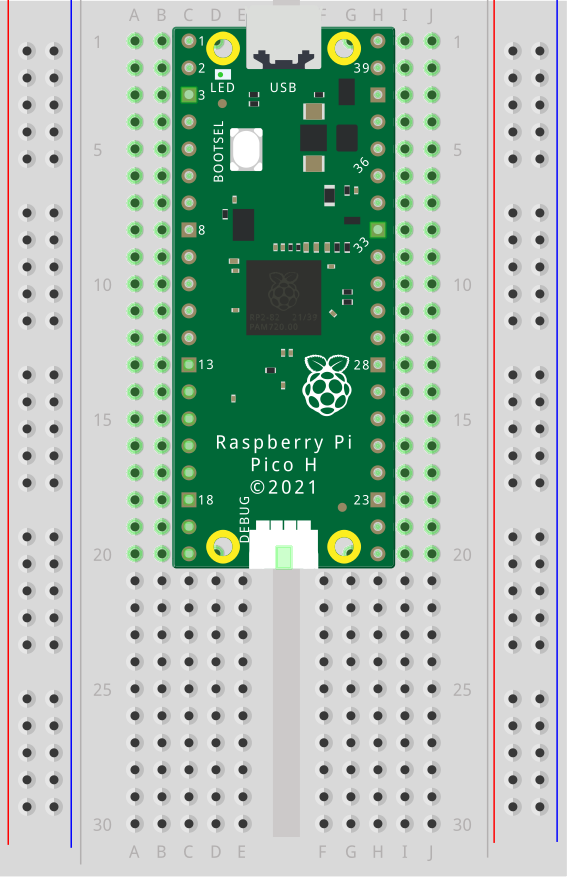
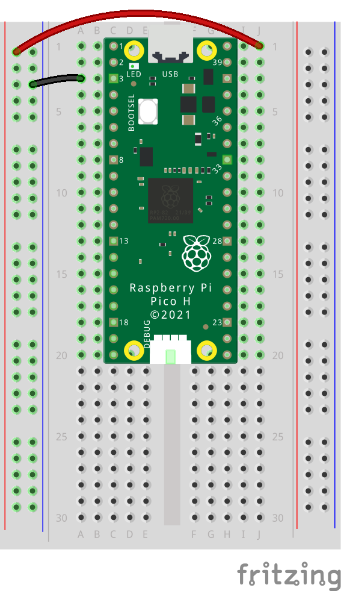
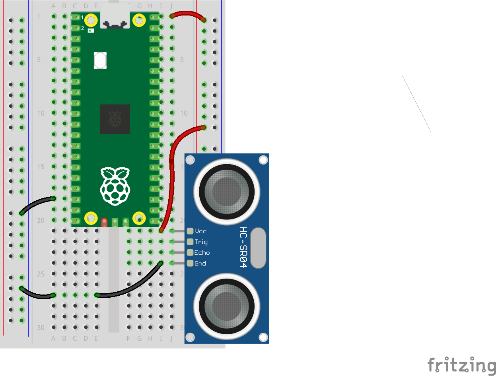
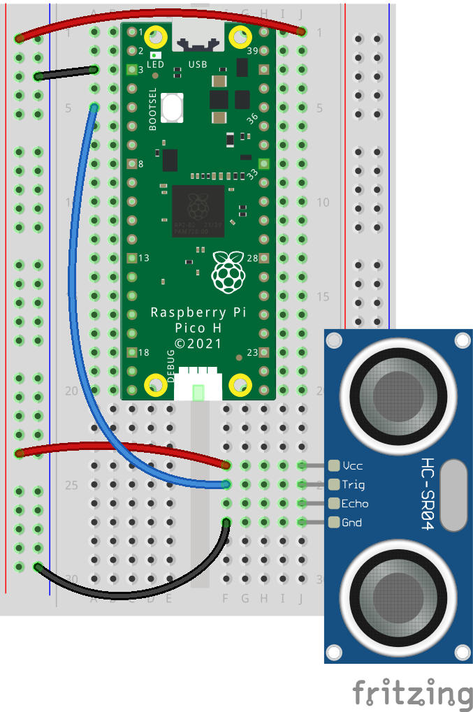
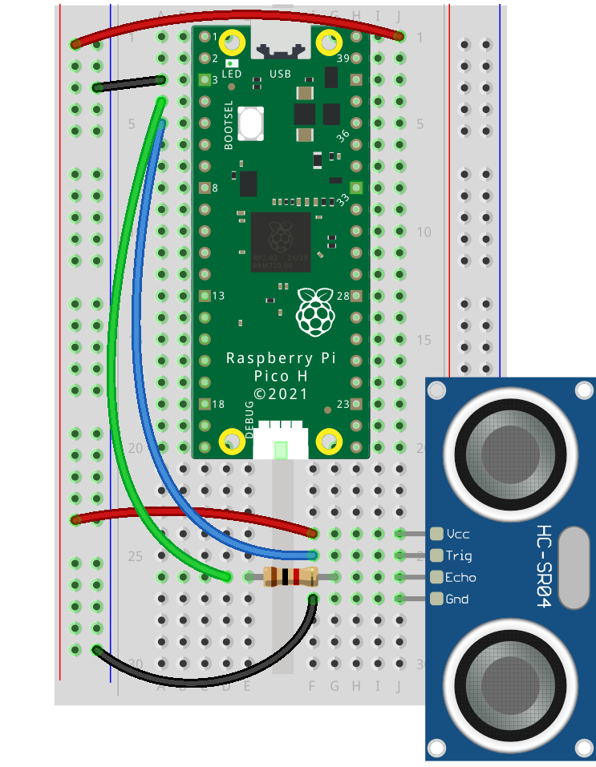
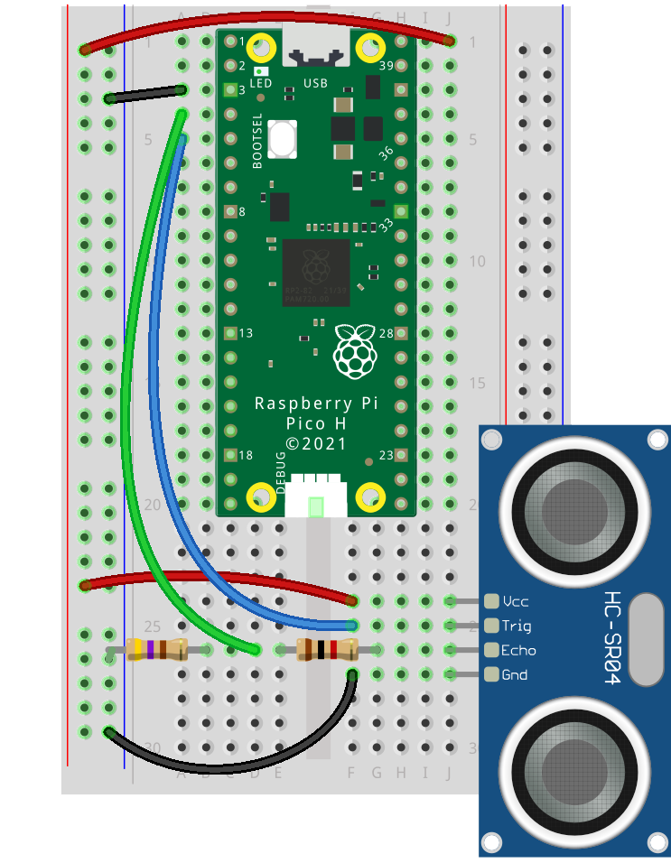

## Wire the sensor circuit

Connect the sensor and relay to the Pico. Keep Echo at 3.3 V logic with a divider.

--- task ---
 
Set the Raspberry Pi Pico securely on a breadboard or workspace so you can easily access all pins for wiring.
{:width="300px"} 

--- /task ---

--- task ---

Connect the `VBUS` pin to the Power rail on the edge of your breadboard, and any `GND` pin to the ground rail on your breadboard. This will allow multiple devices to use the power supplied by your power supply. 
{:width="300px"}

--- /task ---

--- task ---
Connect the `VCC` pin on the ultrasonic sensor to the 5V rail, and the `GND` pin to the `GND` rail on the breadboard.
This gives the sensor power to operate. (This configuration of wires will allow for resistors in later tasks.)
{:width="300px"}
--- /task ---

--- task ---
Use a jumper wire to connect the `TRIG` pin on the sensor to `GP3` on the Raspberry Pi Pico.
This pin sends the “ping” signal that starts the distance measurement.
{:width="300px"}
--- /task ---

--- task ---
To protect the Pico’s input pin from 5 V logic, make a voltage divider on the `ECHO` line.
Start by connecting a 1kΩ resistor between the `ECHO` pin on the sensor and `GP2` on the Pico.
{:width="300px"}
--- /task ---

--- task ---
Next, connect a 2kΩ resistor between the `ECHO` pin and `GND` on the breadboard.
This lowers the signal to a safe level (about 3.3 V) for the Pico’s input.
{:width="300px"}
--- /task ---

--- task ---
Double-check your connections:

- The 1kΩ resistor should run from ECHO → GP2.
- The 2kΩ resistor should run from ECHO → GND.
- There should be no loose wires or crossed connections.

--- /task ---