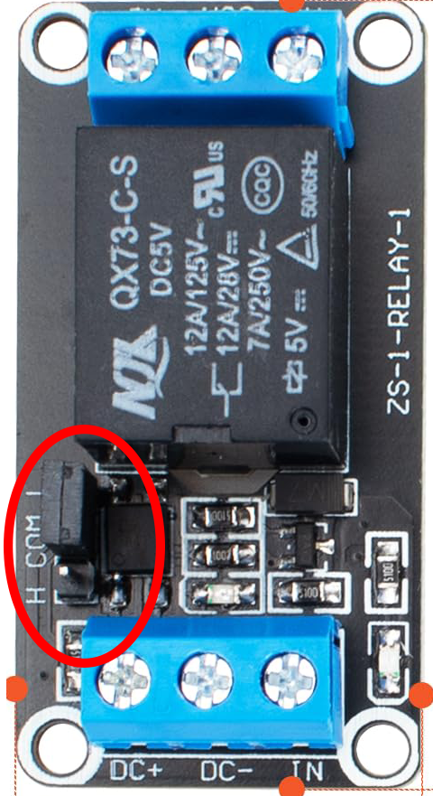
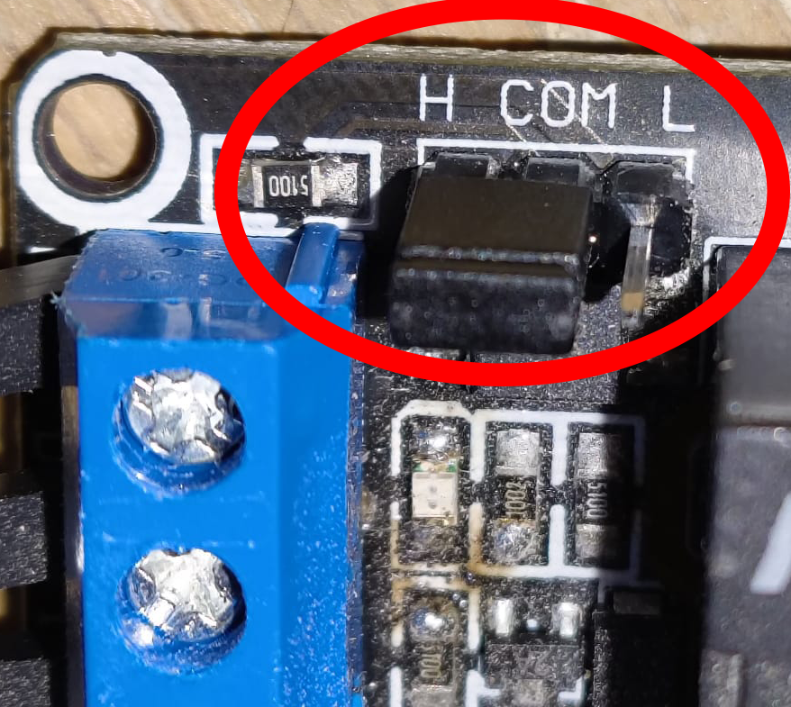
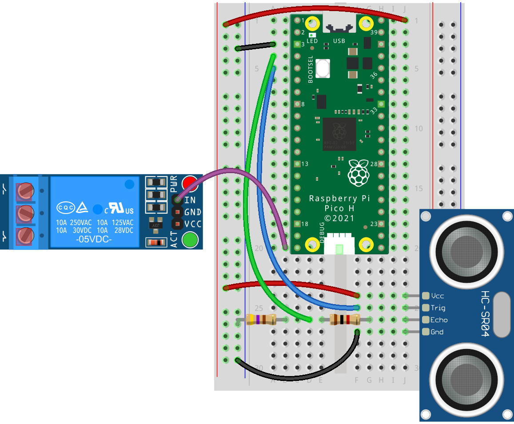
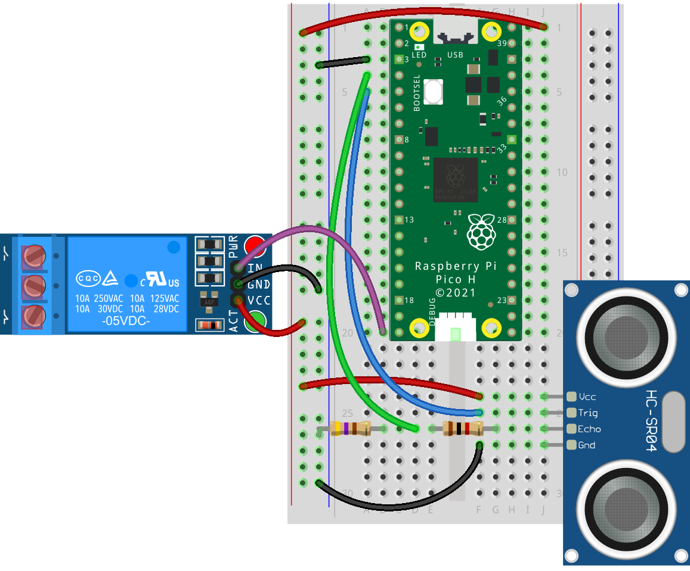
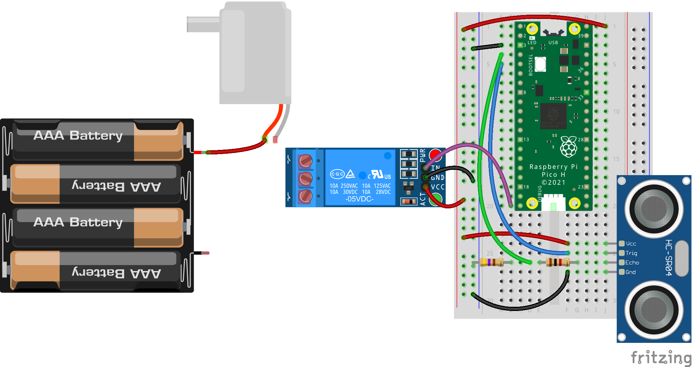
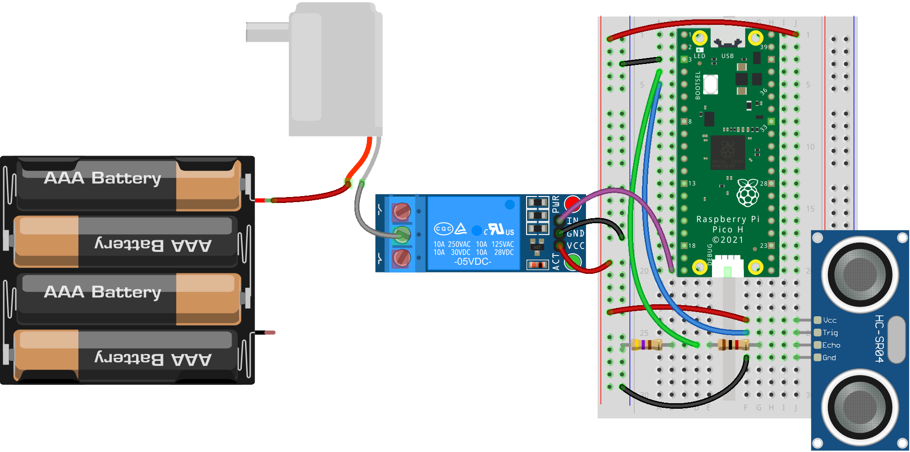
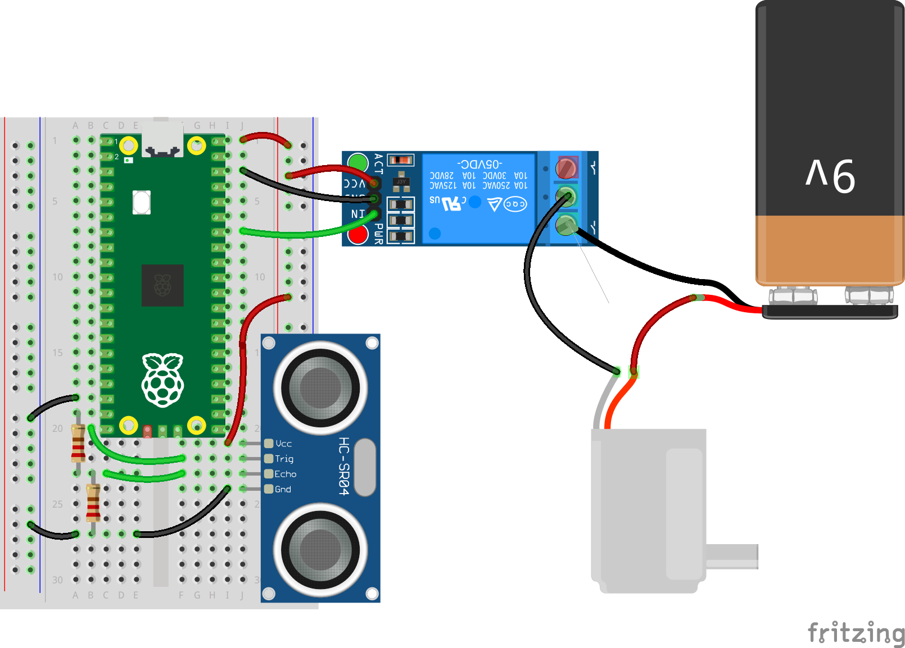

## Wire the relay and pump

Wire the relay and pump circuit that lets the Raspberry Pi Pico safely turn a water pump on and off.

The relay works like a switch that keeps the Raspberry Pi Pico separate from the pump's bigger power supply. When the Raspberry Pi Pico sends a signal, the relay connects the pump with the larger power supply and the pump starts running.

### Set the relay's trigger mode

Before you can control the relay from the Raspberry Pi Pico, you must set the relay's trigger jumper correctly. This tiny jumper tells the relay whether it should switch on when the Raspberry Pi Pico pin is set to **HIGH** or **LOW**.

--- task ---

Look closely at the three-pin header on your relay board. It will be labelled **H COM L**.

{:width="300px"}

- **H:** High trigger (the relay turns **on** when the signal is **high**)
- **L:** Low trigger (the relay turns **on** when the signal is **low**)
- **COM:** Common pin shared with the jumper

Check where the small plastic jumper is sitting.

For this project, you must connect the jumper across **COM H**, not **COM L**.

This will put the relay into high-trigger mode. You will add code for the Raspberry Pi Pico to match this in the next step.

--- /task ---

--- task ---

Slide the jumper so that it firmly connects **COM** and **H**. It should sit squarely over the two pins — if it is not positioned securely, the relay will not behave correctly.

{:width="300px"}

--- /task ---

--- task ---

Connect the **IN** pin on the relay terminal block to **GP28** on the Raspberry Pi Pico. This will act as the pump control signal.

{:width="600px"}

--- /task ---

--- task ---

Connect **VCC** on the relay terminal block to the 5V rail on the breadboard, and connect **GND** to the ground rail on the breadboard. The relay coil now shares power with the sensor.

{:width="600px"}

--- /task ---

### Connect the mini DC water pump

--- task ---

Connect the pump's **+** (usually red) wire to the positive terminal of your external 5–12V DC power supply (also probably a red wire).

{:width="800px"}

--- /task ---

--- task ---

Connect the pump's **–** (usually black) wire to the **COM** (Common) terminal on the relay.
{:width="800px"}

--- /task ---

--- task ---

Then, connect the **NO** (Normally Open)terminal on the relay to the negative terminal of the DC power supply (probably a black wire).

{:width="800px"}

--- /task ---

When the relay is triggered by the Raspberry Pi Pico, it will close the circuit and power the pump. This keeps the Raspberry Pi Pico safely isolated from the pump's higher-current circuit.

**Important:** Do not run your pump outside of water for too long, or it will heat up and may get damaged!